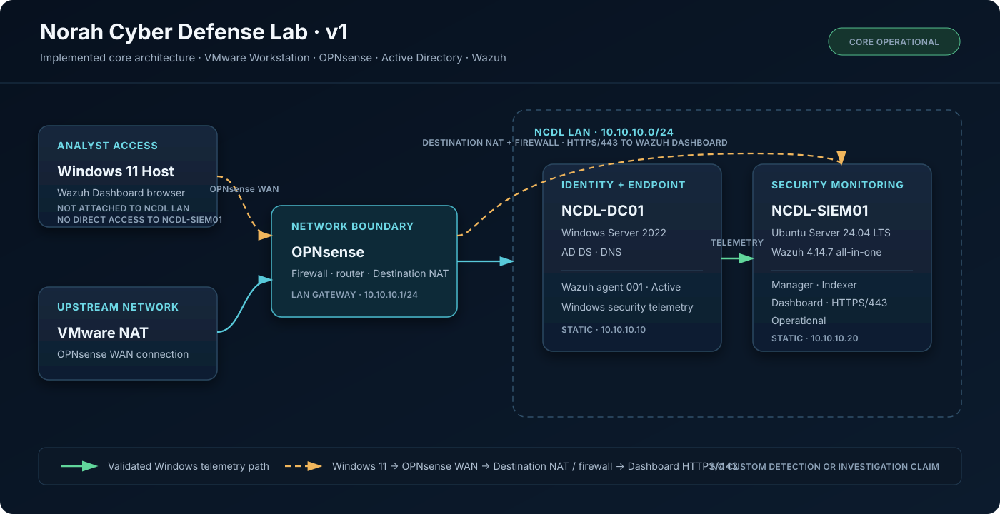

# Norah Cyber Defense Lab

An enterprise-style cyber defense home lab designed to demonstrate SOC analysis, detection engineering, Active Directory security, network monitoring, threat hunting, and DFIR through reproducible, evidence-backed work.

> **Current Status: Foundation / Planned Deployment**
>
> The repository structure and target design are complete. Infrastructure deployment and validation have not started; no operational results are claimed.

## What this project demonstrates

- Designing segmented enterprise networks with explicit trust boundaries
- Engineering telemetry across identity, endpoint, firewall, and network sources
- Building and validating SIEM detections mapped to MITRE ATT&CK
- Investigating alerts with reproducible queries, timelines, and source evidence
- Using endpoint and network data for threat hunting and DFIR
- Running controlled adversary simulations inside an isolated lab boundary
- Communicating technical findings through analyst notes and incident reports

## Planned technology stack

| Layer | Technologies under evaluation or planned |
|---|---|
| Network and segmentation | OPNsense or pfSense, VLANs, default-deny inter-VLAN policy |
| Identity and workloads | Active Directory Domain Services, DNS, Windows endpoints, Linux endpoint |
| SIEM and endpoint visibility | Splunk and/or Elastic, Wazuh, Velociraptor |
| Network security monitoring | Zeek, Suricata |
| Validation environment | Isolated Kali Linux host; controlled lab activity only |
| Analysis framework | MITRE ATT&CK, evidence-linked SOC workflow |

Tool selection and proposed addressing remain design decisions until deployment testing is complete.

## Architecture overview

The planned environment places identity, user, Linux, security, sensor, management, and adversary systems in separate network segments behind a firewall. Host and network telemetry flows to central analysis tooling. Administrative access is restricted to a management path, and the Kali segment is denied by default except for temporary, scoped validation rules.

Technical detail: [Architecture](docs/ARCHITECTURE.md) | [Network design](docs/NETWORK-DESIGN.md) | [Roadmap](docs/ROADMAP.md)

## Project progress

| Workstream | Status | Evidence required to advance |
|---|---|---|
| Repository foundation | Complete | Documentation and version-controlled structure |
| Network and firewall | Planned | Sanitized rules, reachability tests, sensor visibility |
| AD DS, DNS, and endpoints | Planned | Configuration validation and asset inventory |
| SIEM, EDR, and NSM telemetry | Planned | Source-by-source ingestion and parsing checks |
| Detection engineering | Planned | Versioned analytics with reproducible validation |
| Investigations and DFIR | Planned | Queries, timelines, source evidence, and findings |
| Controlled simulations | Planned | Approved plan, isolation checks, observations, and cleanup record |

"Complete" above applies only to the repository foundation, not to lab deployment.

## Project navigation

| Section | Contents |
|---|---|
| [Architecture](docs/ARCHITECTURE.md) | Trust boundaries, telemetry flow, SOC workflow, and ATT&CK strategy |
| [Network design](docs/NETWORK-DESIGN.md) | Planned VLANs, traffic policy, sensor placement, and validation criteria |
| [Roadmap](docs/ROADMAP.md) | Evidence-gated deployment phases |
| [Detections](detections/README.md) | Detection logic, test records, and ATT&CK mappings |
| [Investigations](investigations/README.md) | SOC case notes, hunting records, queries, and timelines |
| [Incident reports](incident-reports/README.md) | Evidence-supported incident-style reporting |
| [Attack simulations](attack-simulations/README.md) | Authorized validation plans and safety controls |
| [Evidence](evidence/README.md) | Raw artifacts, exports, integrity data, and screenshots |
| [Configurations](configs/README.md) | Sanitized defensive configurations and deployment notes |

## Evidence integrity

Only artifacts captured from actual, validated lab activity will be presented as evidence. Screenshots, logs, alerts, findings, and test results will remain absent until produced; published artifacts will record source, time, method, redactions, and limitations. See the [evidence standard](docs/ARCHITECTURE.md#evidence-standards).

## Scope

All simulations will be limited to owned, isolated lab systems. This repository will not contain malware, credentials, persistence tooling, or executable offensive scripts.

Licensed under the [MIT License](LICENSE).
