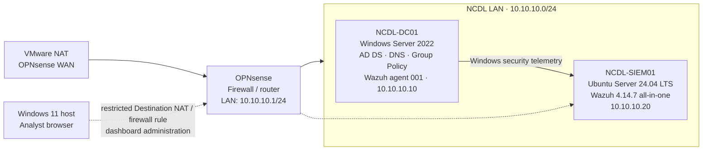
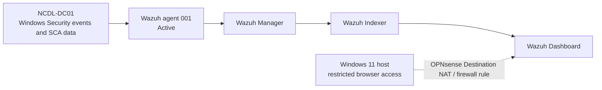
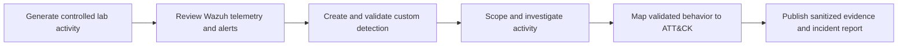

# Architecture

**Status: Core NCDL v1 infrastructure implemented and validated**

This document describes the lab as it exists now and separates operational components from unfinished SOC work.

## Current logical architecture

The Windows 11 host is not directly attached to the NCDL LAN. Administrative access to the Wazuh Dashboard is provided through a restricted OPNsense Destination NAT and firewall rule.

## Implemented components

| Component | Role | Validated state |
|---|---|---|
| VMware Workstation | Hypervisor and virtual networking | In use |
| OPNsense | Firewall and router between VMware NAT and the lab LAN | Deployed; LAN `10.10.10.1/24` |
| `NCDL-DC01` | Domain controller, DNS server, Group Policy source, and monitored Windows system | Windows Server 2022 at `10.10.10.10`; AD DS, DNS, Group Policy, and Windows security auditing implemented |
| `NCDL-SIEM01` | Central Wazuh server | Ubuntu Server 24.04 LTS at `10.10.10.20`; Manager, Indexer, and Dashboard operational |
| Wazuh agent 001 | Windows telemetry collection on `NCDL-DC01` | Active and communicating with `NCDL-SIEM01` |
| Windows 11 host | Analyst access to Wazuh Dashboard | Access provided through the restricted OPNsense rule |

## Current telemetry flow

Wazuh currently displays:

- Windows process creation events;
- authentication and logon/logoff events;
- Security Configuration Assessment findings.

This confirms collection and visibility for these data categories. It does not claim custom detection coverage, alert quality, investigation results, or ATT&CK coverage.

## NCDL v1 SOC workflow

The remaining work will use the deployed telemetry path:

These steps are **planned for NCDL v1**. None is complete unless the corresponding artifact and evidence are added to the repository.

## Investigation standard

The planned end-to-end investigation will record:

1. The controlled activity and expected telemetry.
2. Alert or event source, rule, host, timestamp, and time zone.
3. Exact Wazuh filters or queries used for scoping.
4. A timeline separating observations from analyst inference.
5. The validated ATT&CK technique or sub-technique, if supported.
6. Detection limitations, alternative explanations, and telemetry gaps.
7. Links to sanitized source evidence and the incident report.

## MITRE ATT&CK use

ATT&CK mappings will be added only after behavior is generated, observed, and validated. A mapping must identify the ATT&CK version, technique or sub-technique, supporting telemetry, analytic assumptions, and validation method. Technique counts will not be used as a substitute for tested coverage.

## Evidence standards

Each completed activity must record:

1. Purpose and scope.
2. Capture date, timezone, asset, and software version.
3. Exact query, collection method, or configuration reference.
4. Expected and observed results, recorded separately.
5. Sanitized source artifacts or exports.
6. SHA-256 hashes for material exports where practical.
7. Redactions, limitations, and telemetry gaps.
8. Links between the detection, investigation, evidence, and report.

Use `YYYY-MM-DD_short-description` for evidence names and prefer UTC timestamps in investigations. No evidence should be reconstructed for presentation. See the [`evidence/` guide](../evidence/README.md).

## Optional future enhancements

Additional VLANs, Splunk, Elastic, Zeek, Suricata, Velociraptor, Linux endpoints, and a dedicated adversary environment are outside NCDL v1. They are optional future enhancements, not current dependencies or implemented components.

## Related documents

- [Network Design](NETWORK-DESIGN.md)
- [Roadmap](ROADMAP.md)
- [Repository overview](../README.md)
