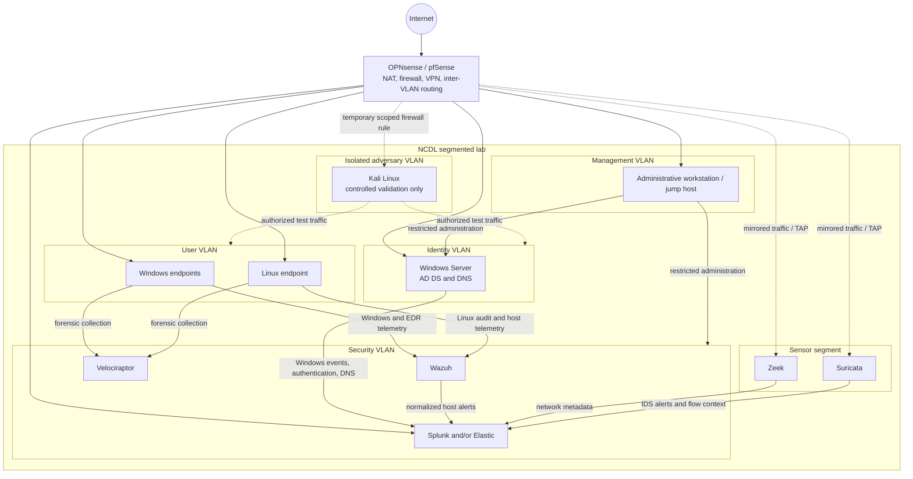
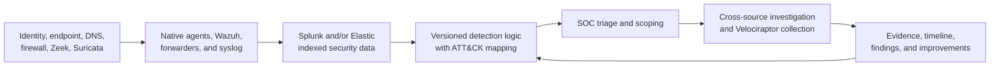
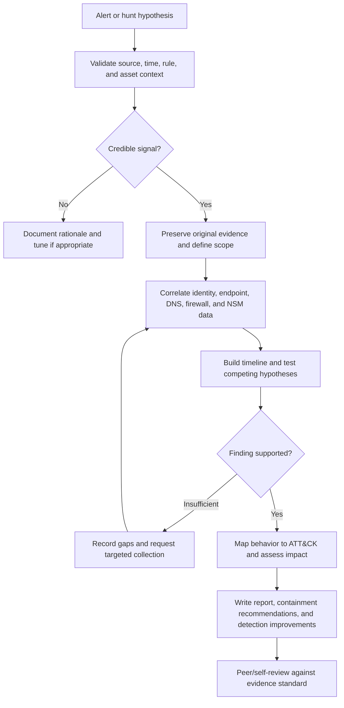

# Architecture

**Status: Planned design - not deployed**

This document records the target architecture and the controls that must be validated before the lab is described as operational.

## Design goals

- Model enterprise trust boundaries at home-lab scale.
- Collect complementary identity, endpoint, DNS, firewall, and network telemetry.
- Keep security tooling and administrative access separated from user workloads.
- Make detections and investigations reproducible.
- Contain adversary simulation within an explicitly isolated environment.

## Logical architecture

The SIEM will be selected after resource testing. If both Splunk and Elastic are used, each must have a distinct use case.

## Trust boundaries

| Zone | Primary assets | Security intent |
|---|---|---|
| Identity | Domain controllers and DNS | Most restricted workload tier; only required client and management traffic |
| User | Windows and Linux endpoints | Representative monitored workloads; no direct administrative path to security tooling |
| Security | SIEM, Wazuh, Velociraptor | Central collection and analysis; restricted ingestion and analyst access |
| Sensor | Zeek and Suricata | Receives mirrored traffic; management allowed only from the management VLAN |
| Management | Jump host and administration services | Dedicated privileged access path with logging and limited egress |
| Adversary | Kali Linux | Default-deny boundary; temporary, documented access only during approved exercises |

Addressing and proposed policy are defined in [Network Design](NETWORK-DESIGN.md).

## Telemetry flow

Planned minimum telemetry includes:

| Source | Planned data | Defensive value |
|---|---|---|
| Active Directory | Security events, authentication, group and account changes | Identity misuse and privilege-change analysis |
| Windows endpoints | Process, logon, PowerShell, service, persistence, and network events | Endpoint detection and timeline reconstruction |
| Linux endpoint | Authentication, process, audit, and network events | Cross-platform host monitoring |
| OPNsense/pfSense | Firewall, DHCP, VPN, and DNS-related logs where applicable | Boundary and connection context |
| Zeek | Connection, DNS, HTTP, TLS, and protocol metadata | Network behavior and pivoting context |
| Suricata | IDS alerts and flow records | Signature-based alerting and packet-level context |
| Wazuh | Agent events, file integrity, and normalized alerts | Host monitoring and alert enrichment |
| Velociraptor | Targeted artifacts collected during approved investigations | DFIR acquisition and endpoint scoping |

Retention, time synchronization, parsing health, and host identity consistency will be validated before analytics are treated as reliable.

## SOC investigation workflow

An investigation must distinguish observation from inference. Queries, time ranges, source systems, and relevant identifiers should be recorded so another analyst can reproduce the work.

## MITRE ATT&CK alignment strategy

ATT&CK will be used as a behavioral index, not as a scorecard. Each detection, simulation plan, and supported finding should include:

- ATT&CK version and technique or sub-technique identifier;
- the observable behavior and required telemetry;
- analytic assumptions and known blind spots;
- validation method and expected artifacts;
- links to the related detection, investigation, evidence, and report.

Coverage will only be claimed when a versioned analytic has been executed against an authorized test or representative dataset and the result is preserved. Technique counts alone will not be presented as proof of defensive effectiveness.

## Evidence standards

Each completed activity must link to versioned source artifacts and record:

1. Purpose and scope.
2. Capture date, timezone, lab phase, asset role, and data-source version.
3. Exact query, collection method, or configuration reference.
4. Expected and observed results, recorded separately.
5. Relevant raw evidence or exports, sanitized for secrets and personal data.
6. SHA-256 hashes for material exported artifacts where practical.
7. Limitations, alternative explanations, and telemetry gaps.
8. Links to associated detections, investigations, simulations, and reports.

File names should use `YYYY-MM-DD_short-description` and UTC timestamps should be preferred inside investigations. Redaction must be declared; artifacts must never be edited in a way that changes their security meaning. See the [`evidence/` guide](../evidence/README.md).

## Architectural decisions still open

- Hypervisor and available compute capacity
- OPNsense versus pfSense
- Splunk, Elastic, or a deliberately scoped combination
- Endpoint telemetry configuration and retention periods
- Virtual traffic-mirroring method for Zeek and Suricata
- Internal naming convention and final IP ranges

These decisions will be recorded with rationale during the relevant [roadmap](ROADMAP.md) phase.

## Related documents

- [Network Design](NETWORK-DESIGN.md)
- [Roadmap](ROADMAP.md)
- [Repository overview](../README.md)
